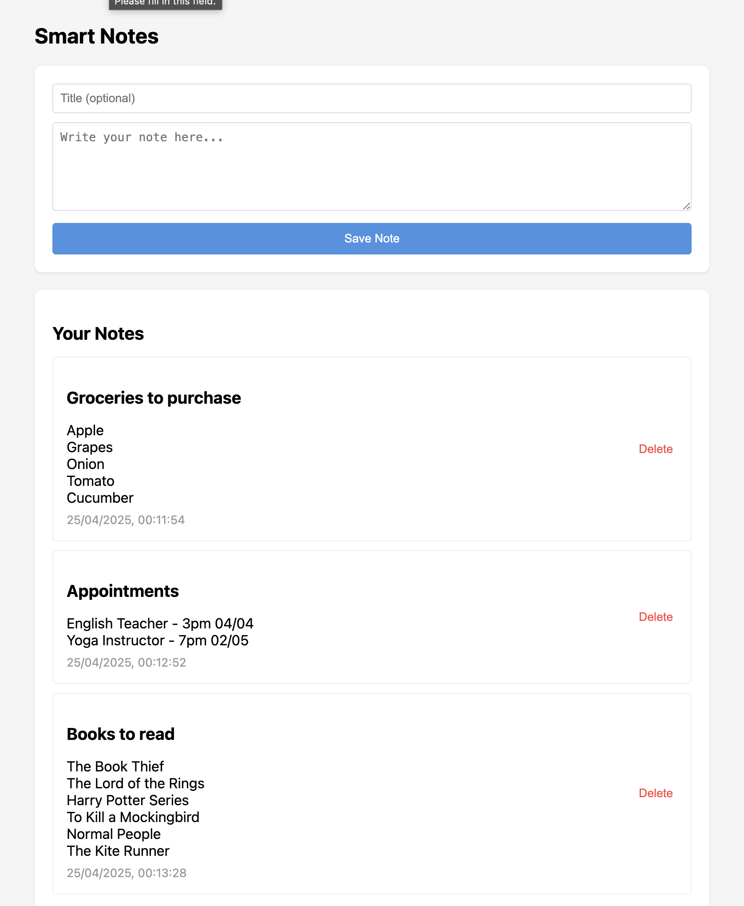

# Smart Notes Web Application




A modern note-taking web application with real-time synchronization and optional AI-powered enhancements.

## 🌟 Key Features

### Core Functionality
- **Full CRUD Operations**: Create, view, edit, and delete notes with intuitive controls
- **Real-time Synchronization**: Instant updates across devices using Firebase Firestore
- **Clean Interface**: Minimalist design focused on usability
- **Responsive Layout**: Works seamlessly on desktop and mobile devices

### AI Enhancements (Optional)
- **Automatic Title Generation**: AI suggests relevant titles for new notes
- **Smart Tagging**: Automatically categorizes notes with appropriate tags
- **Content Improvement**: AI-powered writing suggestions
- **Summary Generation**: Creates concise summaries of lengthy notes

## 🛠 Technical Implementation

### 🛠 Stack Overview

| Technology | Purpose | Package |
|------------|---------|---------|
| React      | Frontend framework | `react` |
| Redux Toolkit | State management | `@reduxjs/toolkit` |
| Firebase Firestore | Database | `firebase` |
| Vite | Build tool | `vite` |
| Tailwind CSS | Styling | `tailwindcss` |

### Frontend Architecture
- Built with **React** for component-based UI development
- **Redux Toolkit** manages application state
- **Vite** provides fast development tooling
- **Tailwind CSS** enables responsive styling

### Backend Services
- **Firebase Firestore**: NoSQL database for real-time data sync
- **Firebase Authentication**: Ready for future user management
- **OpenAI API**: Powers optional AI features (requires API key)


## 🚀 Getting Started

### System Requirements
- Node.js (version 16 or higher)
- Modern web browser (Chrome, Firefox, Edge recommended)
- Firebase project (free tier available)

### Installation Process
1. Clone the repository to the local machine
2. Install all required dependencies using npm
3. Configure Firebase connection with the project credentials
4. Set up environment variables for secure API access
5. Launch the development server

### Configuration Notes
- Firebase setup requires enabling Firestore database
- OpenAI features need a valid API key
- Environment variables are stored securely in `.env.local`

-----

## 🔍 AI Feature Details

The app can be enhanced with these OpenAI-powered features (requires API key):
### AI Functions for Enhancements
1. **Auto-Title Generation**  
   Analyzes note content to suggest appropriate titles
   
   Example:

    ```javascript
    // src/services/openai.js
    import OpenAI from 'openai';

    const openai = new OpenAI({
    apiKey: import.meta.env.VITE_OPENAI_KEY,
    dangerouslyAllowBrowser: true
    });

    export const generateTitle = async (content) => {
    const prompt = `Generate a concise title (max 5 words) for this note: ${content.substring(0, 500)}`;
    
    const response = await openai.chat.completions.create({
        model: "gpt-3.5-turbo",
        messages: [{ role: "user", content: prompt }],
        max_tokens: 20
    });

    return response.choices[0].message.content;
    };
2. **Content Tagging and Summarization**  
   Identifies key themes to auto-generate relevant tags and creates summaries for long notes.

   Example:

    ```javascript
    export const summarizeContent = async (content) => {
    const prompt = `Summarize this note in 3 bullet points:\n\n${content.substring(0, 2000)}`;
    
    const response = await openai.chat.completions.create({
        model: "gpt-3.5-turbo",
        messages: [{ role: "user", content: prompt }],
        temperature: 0.7
    });

    return response.choices[0].message.content;
    };

    export const generateTags = async (content) => {
    const prompt = `Suggest 3-5 tags for this note (comma-separated):\n\n${content.substring(0, 1000)}`;
    
    const response = await openai.chat.completions.create({
        model: "gpt-3.5-turbo",
        messages: [{ role: "user", content: prompt }],
        max_tokens: 30
    });

    return response.choices[0].message.content.split(',').map(tag => tag.trim());
    };
    ```
3. **Writing Enhancement**  
   Provides grammar and style improvements

    Example:

    ```javascript
    export const improveWriting = async (content) => {
    const prompt = `Improve the writing of this note while preserving its meaning:\n\n${content.substring(0, 2000)}`;
    
    const response = await openai.chat.completions.create({
        model: "gpt-3.5-turbo",
        messages: [{ role: "user", content: prompt }],
        temperature: 0.5
    });

    return response.choices[0].message.content;
    };
    ```

### Implementation Considerations
- AI features require an OpenAI API key
- API calls are made directly from the client side
- Users can opt-in/opt-out of AI features
- Rate limiting should be considered for production use

---
## 🏗 Project Structure Overview
    smart-notes/
    ├── src/
    │ ├── components/ # UI components
    │ ├── features/ # State management
    │ ├── services/ # API integrations
    │ ├── App.jsx # Main component
    │ └── main.jsx # Entry point
    ├── public/ # Static assets
    ├── .env.example # Environment template
    └── package.json # Dependencies


## 🚢 Deployment Options

### Recommended Platforms
1. **Vercel**: Simple deployment with Git integration
2. **Firebase Hosting**: Native integration with Firebase services
3. **Netlify**: Alternative with similar capabilities

### Deployment Checklist
- Verify all environment variables are set
- Test production build locally
- Configure proper security rules for Firestore
- Enable CORS if needed for API access
